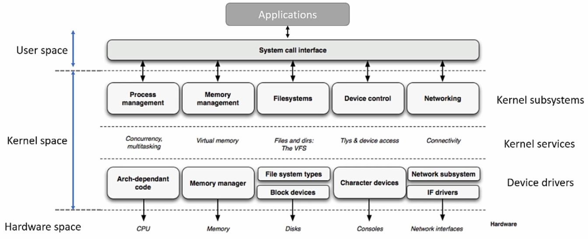

# Lessons Learned


## Project Environment Setup

* Install necessary packages on the host:

  ```plain
  sudo apt update
  ```

  ```plain
  sudo apt install build-essential lzop u-boot-tools net-tools bison flex libssl-dev libncurses5-dev libncursesw5-dev unzip chrpath xz-utils minicom
  ```

* Setup the workspace:

  * `custom_drivers/`
  * `downloads/`
  * `patches/`
  * `source/`

* Download boot images and root filesystem

  * Boot images - `pre-built-images.zip`
    * `am335x-boneblack.dtb` - Device tree binary of BBB
    * `MLO` - Primary boot loader (Memory LOader)
    * `u-boot` - U-boot bootloader image
    * `uEnv.txt` - U-boot commands and environment settings
    * `uImage` - Kernel image 
  * Debian root filesystem - `bone-debian-9.9-iot-armhf-2019-08-03-4gb.img.xz` (https://beagleboard.org/)

* Prepare $\micro$SD card

  * Partition 1 - BOOT / FAT16 / Stores boot images (e.g., MLO, U-boot, kernel image) / 512MB
  * Partition 2 - ROOTFS / EXT4 / Stores Debian root filesystem / Rest of the $\micro$SD card

* Download cross-compiler and toolchain

  * To cross-compile the Linux kernel, Linux application, and kernel modules to ARM Cortex-Ax architecture, cross-compiler is necessary.
  * The SoC AM335x from TI is based on ARM Cortex-A8 processor of ARMv7 architecture.
  * Download the cross-compiler - `gcc-linaro-7.5.0-2019.12-x86_64_arm-linux-gnueabihf` (https://releases.linaro.org/components/toolchain/binaries/7.5-2019.12/arm-linux-gnueabihf/)
    * Older versions: https://releases.linaro.org/components/toolchain/binaries/
    * Newer versions: https://snapshots.linaro.org/gnu-toolchain/

* Add the toochain binary path to the PATH variable (`.bashrc` in home directory)

  1. Go do the home directory

  2. Open `.bashrc` file using an editor

  3. Add the following command to the `.bashrc` file

     ```plain
     export PATH=$PATH:<path_to_toolchain_binaries>
     ```

     > e.g., `export PATH=$PATH:/home/klee/linux-device-drivers/workspace/downloads/gcc-linaro-7.5.0-2019.12-x86_64_arm-linux-gnueabihf/bin`

     Or simply do
  
     ```plain
     echo "export PATH=$PATH:<path_to_toolchain_binaries>" > ~/.bashrc
     ```
  
  4. In the terminal, type `arm` and hit `tab` to see if the system recognizes the binaries.


## Connecting the Host with the Target (USB-to-Serial TTL Cable)

* Pin mapping

  | USB-to-Serial TTL Cable Pins | BBB J1 Header Pin Outs |
  | ---------------------------- | ---------------------- |
  | Pin 1 - GND (Black)          | Pin1 - GND             |
  | Pin 4 - RXD (Oragne)         | Pin 5 - TXD            |
  | Pin 5 - TXD (Yellow)         | Pin 4 - RXD            |

  > Make sure to cross-connect TXDs and RXDs!

  

## Boot Sequence of BeagleBone Black Board

* The boot sequence is determined by the `SYSBOOT[4:0]` bit field of the control register. This bit field value changes depending on whether the **boot button** is pressed on power-up or not.
* AM335x boot sequence
  * [Default] Boot button NOT pressed on power-up:
    1. MMC1 (eMMC)
    2. MMC0 ($\micro$SD)
    3. UART0
    4. USB0
  * Boot button pressed on power-up:
    1. SPI0
    2. MMC0 ($\micro$SD)
    3. USB0
    4. UART0


## Usage of Power Button, Reset Button and Boot Button

* Power button

  By pressing and holding this button for 10 to 20 seconds, you can power down the board. Once you power down the board, gently pressing this button one time will power up the board again. Instead of connecting and disconnecting the power source to your board, you can use this button to power down and power up.

* Reset button

  Pressing this button resets the board. Note that the boot sequence is not affected by the reset action.

* Boot button

  This button can be used to change the boot sequence during the power up of the board.


## $\micro$SD Preparation

1. 8+ GB $\micro$SD card can be used

2. Connect the $\micro$SD card to PC using card reader

   * Use `dmesg` or `lsblk` command to check if your system recognizes the device (e.g., sda)

3. Launch the GParted application

4. Create 2 partitions (FAT16 and EXT4)

   * Partition 1 - BOOT / FAT16 / Stores boot images (e.g., MLO, U-boot, kernel image) / 512MB
   * Partition 2 - ROOTFS / EXT4 / Stores Debian root filesystem / Rest of the $\micro$SD card

   [!] Note: Make sure to click "Apply" button (green check) after creating partitions.

5. Configure the flags of BOOT partition; `lba`, `boot`

   

   

   

   Once you close GParted app, you'll see the newly created partitions appear on your system.

6. Copy boot images on FAT16 partition (BOOT partition)

   ```plain
   sudo cp -a workspace/downloads/pre-built-images/SD-boot/* /media/klee/BOOT/
   ```

   > `am335x-boneblack.dtb` - Device tree binary of BBB
   >
   > `MLO` - Primary boot loader (Memory LOader)
   >
   > `u-boot` - U-boot bootloader image
   >
   > `uEnv.txt` - U-boot commands and environment settings
   >
   > `uImage` - Kernel image 

   ```plain
   sync
   ```

   > To flush left-over contents in the buffer to the media

7. Copy Debian root filesystem on EXT4 partition (ROOTFS partition)

   * Decompress the downloaded Debian image:

     ```plain
     unxz bone-debian-9.9-iot-armhf-2019-08-03-4gb.img.xz
     ```

   * Right-click the `.img` file $\to$ Open With Disk Image Mounter. This will mount the image to the filesystem.

     Check the mount status by running:

     ```plain
     lsblk
     ```

     

     

     

   * Copy the contents of mounted `rootfs/` into `/media/klee/ROOTFS`.

     ```plain
     sudo cp -a /media/klee/rootfs/* /media/klee/ROOTFS
     ```

     ```plain
     sync
     ```

     > To flush left-over contents in the buffer to the media

8. Unmount and remove the $\micro$SD card from PC

9. Power down the board, insert the $\micro$SD card into BBB $\micro$SD card slot

10. Boot from $\micro$SD card (MMC0 interface)


## Booting from $\micro$SD Card Interface (MMC0)

1. Make sure that BBB board is NOT powered up

2. Connect BBB board and host using serial debug cable

   * Check if connection has been successfully established by running `dmesg`.

     

     

     > This means that the host will serial communicate with the target board over the device file `ttyUSB0`.

   * Run minicom:

     ```plain
     (sudo) minicom
     ```

     > Run `minicom -s` to configure the environment such as selecting the serial device (e.g., `/dev/ttyUSB0`).
     >
     > `ctrl + a`, `x` to exit.

3. Insert the SD card to BBB board

4. Power up the board using mini USB cable

5. Press and hold the boot button (S2)

6. Press and hold the power button (S3) until the blue LED turns off and turns back on. (If the blue LED doesn't turn back on, gently press the power button.)

7. Release the S2 button after 2 to 5 seconds.

Check if the board is successfully booting from $\micro$SD card.

### Pro Tip!

* It would be great if we could force the board to boot from the $\micro$SD card (MMC0 interface) by default without having to manipulate any buttons.

  $\to$ This can be done by making eMMC (MMC1 interface) boot fail in the default boot sequence so that the board attempts to boot from the $\micro$SD card (MMC0 interface) 

* **When BBB is pre-installed with older Debian eMMC image** 

  As a root: `sudo -s`

  1. Create a temporary mount point:

     ```plain
     mkdir /media/tmp1
     ```

  2. Mount the partition 1 of the Debian image to the mount point created in the previous step:

     ```plain
     mount /dev/mmcblk1p1 /media/tmp1/
     ```

     > BOOT partition (partition 1)

  3. `cd` to the mount point and alter the name of `MLO` file to something else (e.g., `MLO.bak`):

     ```plain
     cd /media/tmp1/
     ```

     ```plain
     mv MLO MLO.bak
     ```

     > `MLO` can be restored easily by changing the name back.

     This will prevent the board from finding the `MLO` file during its boot process, and in turn cause boot from eMMC failure.

  4. Reboot and see if the board boot from $\micro$SD card successfully.

* **When BBB is pre-installed with newer Debian eMMC image** (You may not see `/dev/mmcblk1p2` partition and `MLO` file. You'll see `mmcblk1p1` only!) 

  

  

  

  As a root: `sudo -s`, we'll take a snapshot of `MBR` and zero out it to cause boot failure.

  1. Take a snapshot of `MBR`:

     ```plain
     dd if=/dev/mmcblk1 of=emmcboot.img bs=1M count=1
     ```

     > `if`/`of` - Input/output file
     >
     > `bs` - Block size

  2. Zero-out `MBR`:

     ```plain
     dd if=/dev/zero of=/dev/mmcblk1 bs=1M count=1
     ```

  3. Reboot and see if the board boot from $\micro$SD card successfully.

  [!] Note: To restore the `MBR`:

  ```plain
  dd if=emmcboot.img of=/dev/mmcblk1 bs=1M count=1
  ```

  

## Linux Kernel Source Update

1. Clone the kernel source from BBB official GitHub repository (https://github.com/beagleboard/linux) $\to$ This will clone the master branch of the repository. You will need to checkout a specific branch (i.e., kernel source version).

   * 4.14 is used for this project

     In the `workspace/source/` directory:

     ```plain
     git clone https://github.com/beagleboard/linux.git linux_bbb_4.14
     ```
   
   * `cd` to `linux_bbb_4.14/` and run `git checkout 4.14`.

2. Compile and generate the kernel image from the downloaded kernel image directory (`workspace/source/linux_bbb_4.14/`)

   * Step 1:

     ```plain
     make ARCH=arm distclean
     ```

     > Removes all the temporary folder, object files, images generated during the previous build. 
     >
     > Also, deletes the `.config` file if created previously.

   * Step 2:

     ```plain
     make ARCH=arm bb.org_defconfig
     ```

     > Creates a `.config` file by using default config file given by the vendor (Default config file can be found in `workspace/source/linux_bbb_4.14/arch/arm/configs/`)

   * Step 3 (Optional):

     ```plain
     make ARCH=arm CROSS_COMPILE=arm-linux-gnueabihf- menuconfig
     ```

     > Run this command only if you want to change some kernel settings before compilation.

   * Step 4: Compile kernel source

     ```plain
     make ARCH=arm CROSS_COMPILE=arm-linux-gnueabihf- uImage dtbs LOADADDR=0x80008000 -j4
     ```

     > Creates a kernel image `uImage`.
     >
     > Compiles all device tree source files, and generates `dtbs`.

     `#error New address family defined, please update secclass_map.` can be resolved by:

     1. `scripts/selinux/genheaders/genheaders.c` $\to$ comment out `#include <sys/socket/h>`
     2. `scrpts/selinux/mdp/mdp.c` $\to$ comment out `#include <sys/socket.h>`
     3. `security/selinux/include/classmap.h` $\to$ add `#include <linux/socket.h>`

     `fatal error: mpc.h: No such file or directory` error may arise, which is caused by the lack of multiple precision complex floating-point library development package `libmpc-dev`. Resolve this error by running:

     ```plain
     sudo apt install libmpc-dev 
     ```

   * Step 5: Build kernel modules

     ```plain
     make ARCH=arm CROSS_COMPILE=arm-linux-gnueabihf- modules -j4
     ```

     > Builds and generates in-tree loadable(M) kernel module (`.ko`).

   * Step 6:

     ```plain
     sudo make ARCH=arm modules_install
     ```

     > Installs all the generated `.ko` files in the default path of the computer (`/lib/modules/<kernel_ver>`).
     
     Now, you should be able to see `/lib/modules/4.14.108+/` directory.

3. Update the $\micro$SD with the new kernel image, dtb and kernel modules

   * To update the kernel image and dtb in the $\micro$SD:

     * Copy `workspace/source/linnux_bbb_5.10/arch/arm/boot/uImage` to `/mdeia/klee/BOOT/` ($\micro$SD card).

     * Copy `workspace/source/linnux_bbb_5.10/arch/arm/boot/dts/am335x-boneblack.dtb` to `/mdeia/klee/BOOT/` ($\micro$SD card). 

       > Don't forget update dtb! It will hang the boot process at 'Starting kernel ...'.
       >
       > Select the dtb file whose name matches the one that is present in the `BOOT` partition of the $\micro$SD card.

   * To update the kernel modules in the $\micro$SD:

     * Copy newly installed kernel modules `/lib/modules/4.14.108+/` to `/media/klee/ROOTFS/lib/modules/` ($\micro$SD card).

     Run `sync` to flush left-over contents in the buffer to the media

4. Boot the board from the updated $\micro$SD card. 

5. Check the kernel version after login:

   ```plain
   uname -r
   ```

   It should display the updated kernel version. (`4.14.108+` in my case)


## Enabling Internet Over USB

* Internet over USB
  * BBB board can communicate with the Internet over the USB cable by sharing the host PC's internet connection.
  * A separate Ethernet cable is not necessary for the BBB board's internet connection.
  * The required drivers are enabled by default in the kernel and loaded when Linux boots on the BBB board.
  * But, you need to enable the internet sharing feature on your host PC to use this service.

### Target Settings

1. First run `ifconfig` and see if your system recognizes `usb0` interface.

   If `usb0` interface does not show up, reboot the board and check again.

   If it still does not show up, execute the following commands and check again:

   ```plain
   sudo modprobe g_ether
   sudo ifconfig usb0 192.168.7.2 up
   ifconfig
   ```

   At this point you'll be able to `ping 192.168.7.1` (to host), but not `ping www.google.com` (to the Internet).

2. Add name server address in `/etc/resolv.conf`:

   ```plain
   nameserver 8.8.8.8
   nameserver 8.8.4.4
   ```

3. Add name server address in `/etc/network/interfaces`

   ```plain
   iface usb0 inet static
   	address 192.168.7.2
   	netmask 255.255.255.252
   	network 192.168.7.0
   	gateway 192.168.7.1
   	dns-nameservers 8.8.8.8		<-- add this
   	dns-nameservers 8.8.4.4		<-- add this
   ```

4. Add default gateway address by running the following command:

   ```plain
   sudo route add default gw 192.168.7.1
   ```

   > We are using the host PC as the default gateway.

   Whenever rebooting the board, you need to run this command to get Internet connection. For simple SSH connection to the host PC, running this command is not required.

### Host Settings

1. Run the following commands:

   ```plain
   sudo iptables --table nat --append POSTROUTING --out-interface <network_interface_name> -j MASQUERADE
   ```

   > `<network_interface_name>` - Your primary connection to the network could be wireless or wired. You must use the name as listed by the command `ifconfig`. (In my case `wlp61s0`)

   ```plain
   sudo iptables --append FORWARD --in-interface <network_interface_name> -j ACCEPT
   ```

   ```plain
   sudo -s
   echo 1 > /proc/sys/net/ipv4/ip_forward
   ```
   
   > Simply running `sudo echo 1 > /proc/sys/net/ipv4/ip_forward` won't work!
   
   Whenever rebooting the board, you need to run these commands. So, may be a good idea to create a short script and execute it on every reboot. For example:

   ```plain
   #!/bin/bash
   ##To run this script do
   ##1. chmod +x usbnet.sh 
   ##2. ./usbnet.sh 
   iptables --table nat --append POSTROUTING --out-interface <network_interface_name> -j MASQUERADE
   iptables --append FORWARD --in-interface <network_interface_name> -j ACCEPT
   echo 1 > /proc/sys/net/ipv4/ip_forward
   ```
   
   > Make sure th replace `<network_interface_name>` with a real name.


## Linux Kernel Module

* Objectives:
  * Write a simple hello world kernel module
  * Compile the kernel module using `kbuild`
  * Transfer a kernel module to BBB board, load and unload

### Linux Kernel Module (LKM)

* Linux supports dynamic insertion and removal of code from the kernel while the system is up and running. The code we add and remove at run-time is called a **kernel module**. (In other words, a LKM is like a plug-in to the running Linux kernel.)
* Once the LKM is loaded into the LInux kernel, you can start using new features and functionalities exposed by the kernel module without even restarting the device.
* LKM dynamically extends the functionality of the kernel by introducing new features to the kernel such as security, device drivers, file system drivers, system calls etc. (modular approach)
* Support for LKM allows your embedded Linux systems to have only minimal base kernel image (less run-time storage) and optional device drivers and other features are supplied on demand via module insertion.
* Example: when a hot-pluggable new device (e.g., USB drive) is inserted, the device driver (i.e., LKM) gets loaded automatically to the kernel.

### Static & Dynamic LKMs

* When building the kernel, modules can be directly linked into the kernel (i.e., static), or built as independent modules that can be loaded/unloaded into/from the kernel at run-time (i.e., dynamic).

  * **Static (y)**

    When you build a Linux kernel, you can make your module statically linked to the kernel image (module becomes part of the final Linux kernel image). This method increases the size of the final Linux kernel image. Since the module is "built-int" into the Linux kernel image, you cannot "unload" the module. It occupies the memory permanently during run-time.

    Increases the size of the Linux kernel image.

  * **Dynamic (m)**

    When you build a Linux kernel, these modules are NOT built into the final kernel image, and rather they are compiled and linked separately to produce `.ko` files. You can dynamically load and unload these modules from the kernel using user space programs such as `insmod`, `modprobe`, and `rmmod`.


## User Space vs. Kernel Space

* User space (Restricted mode) - User-level programs
* Kernel space (Privileged mode) - Kernel-level code (e.g., Linux kernel, subsystems and LKMs)





 

## Linux Kernel Module (LKM) Structure

* Since LKMs are the code running in kernel space, there are certain rules to follow when writing one.
* Sections of an LKM:
  * Header
  * Code
  * Registration
  * Module description

### Header

* This section lists the header files to include.

  ```c
  /*****************************************************************************************
   * INCLUDE (Inclusion of the necessary header files)
   ****************************************************************************************/
  #include <linux/module.h>
  ```

  > Every kernel module must include the header file `linux/module.h`. It provides various macros for writing kernel modules.

* All the kernel header files can be found in the kernel source tree `LINUX_SRC/include/linux`.

* Kernel header vs. User-space header
  * Since kernel modules are to be executed in the kernel space, kernel headers must be used. Do NOT include any user-space library headers like C standard library header files (e.g., `stdio.h`).
  * No user-space library is linked to the kernel module.
  * Most of the relevant kernel headers can be found in `linux_source_bse/include/linux/`.

### Code

* This section implements what the kernel module should do.

* Code section contains 2 entry points:

  * **Module initialization function (or entry point)**

    * Prototype: `int fun_name(void);`

    * Must return a value: 

      * 0 on success

      * Non-zero on module initialization failure where the module will not get loaded in the kernel.

    * This is an entry point to your module.

      * In the case of static modules, this function will get called during the boot-time.

      * In the case of dynamic modules, this function will get called during the module insertion time.

    * There must be one module initialization entry point in every kernel module.

    * What it typically does:

      * Initialization of devices
      * Initialization data structures private to devices
      * Requesting memory dynamically for various kernel data structures and services
      * Request for allocation of major-minor numbers
      * Device file creation

    * The module initialization function is module-specific and should never be called from other modules of the kernel. It should not provide any services or functionalities which may be requested by other modules. Hence, it makes sense to make this function private using `static` though it is optional to do so.

  * **Module clean-up function (or entry point)**

    * Prototype: `int fun_name(void);`
    * This is an entry point when the module gets removed
    * Since a static module cannot be removed at run-time, clean-up function will get called only in the case of a dynamic module when it gets removed by using the user space command such as `rmmod`.
    * If you write a module and you are sure that it will always be statically linked to the kernel, then it is not necessary to implement this function.
    * Even if your static module has a clean-up function, the kernel build system will remove it during the build process if there is an `__exit` marker.
    * What it typically does:
      * In general, it is the reverse operation of the module initialization function; undoing init function.
      * Free the memory requested by the init function
      * De-init the device or leave the device in the "proper state"

* Example:

  ```c
  /*****************************************************************************************
   * CODE (Implementation of what the module does)
   ****************************************************************************************/
  
  /* Module initialization entry point */
  static int __init helloworld_init(void)
  {
      /* Kernel's printf */
      pr_info("Hello world!\n");
          /* 'pr_info()' is a wrapper function for 'printk()'. */
  
      return 0;
          /* Module load will be successful only when the module init entry
             point function returns 0. If it returns non-zero value for any reason,
             loading the module will be unsuccessful. */
  }
  
  /* Module clean-up entry point */
  static void __exit helloworld_exit(void)
  {
      pr_info("Good bye world!\n");
  }
  ```

* Function section attributes:

  * **`__init`**

    ```c
    #define __init			__section(.init.text)
    #define __initdata		__section(.init.data)
    #define __initconst		__section(.init.rodata)
    ```

    > `__section(.init.xxx)` - Compiler directives, which direct the compiler to keep data or code in the output section `.init`.

    * `__init` and `__exit` makes sense only for static modules (built-in modules)
    * `__init` is a macro which will be translated into a compiler directive, which instructs the compiler to put the code in `.init` section of the final ELF of the Linux kernel image.
    * `.init` section will be freed from memory by the kernel during boot-time once all the initialization functions get executed.
    * Since the built-in driver cannot be unloaded, its init function will not be called again until the next reboot. This means that it's not necessary to keep references to the init function after its execution. So, using the `__init` macro is a technique, when used with a function, to make the kernel free the code memory of that function after its execution.
    * Similarly, you can use `__initdata` with variables that will be dropped after the initialization. `__initdata` works similar to `__init` but it works for init "variables" rather than functions. 

  * **`__exit`**

    ```c
    #define __exit			__section(.exit.text)
    ```

    > `__section(.exit.xxx)` - Compiler directives, which direct the compiler to keep data or code in the output section `.exit`.

    * For the built-in modules, clean-up function is not required. So, when the `__exit` macro is used with a clean-up function, the kernel build system will exclude the function during the build process.


### Registration

* Module entry point registration example:

  ```c
  /*****************************************************************************************
   * REGISTRATION (Registration of entry points with kernel)
   ****************************************************************************************/
  module_init(helloworld_init);
  module_init(helloworld_exit);
  ```

  > These are the macros used to register the module's init and clean-up functions with the kernel.
  >
  > Here, `module_init`/`module_exit` are NOT functions, but are macros defined in `linux/module.h`.
  >
  > * `module_init()` macro will add its argument to the init entry point database of the kernel.
  > * `module_exit()` macro will add its argument to exit entry point database of the kernel.

### Module Description

* Module description example:

  ```c
  /*****************************************************************************************
   * MODULE DESCRIPTION (Descriptive information about the module)
   ****************************************************************************************/
  MODULE_LICENSE("GPL");  /* This module adheres to the GPL licensing */
  MODULE_AUTHOR("Kyungjae Lee");
  MODULE_DESCRIPTION("A simple kernel module to pring Hello World");
  MODULE_INFO(board, "BeagleBone Black REV A5");
  ```

  > `MODULE_LICENSE` is a macro used by the kernel module to announce its license type. If you load a module whose license parameter is a non-GPL(General Public License), then the kernel triggers warning of being tainted. This is the way of the kernel letting the users and developers know it's a non-free license based module.
  >
  > The developer community may ignore the but reports you submitted after loading the proprietary-licensed module.
  >
  > The declared module license is also used to decide whether a given module can have access to the small number of "GPL-only" symbols in the kernel.
  >
  > Go to `include/linux/module.h` to find out what are the allowed parameters which can be used with this macro to load the module without tainting the kernel.
  >
  > You can see the module information by running the following command on the `.ko` file:
  >
  > ```plain
  > arm-linux-gnueabihf-objdump -d -j .modinfo helloworld.ko
  > ```


## Building a Kernel Module

* A kernel module can be built in 2 ways:

  * Statically linked to the kernel image

  * Dynamically loadble $\leftarrow$ our focus!

    * **In-tree module** (Internal to the Linux kernel tree)

      These modules are the ones approved by the kernel developers and maintainers that are already part of the Linux kernel source tree.

    * **Out-of-tree module** (External to the Linux kernel tree)

      A module written by a general user, which is not approved by the kernel authorities and may be buggy, to be built and linked to the running kernel, is called an out-of-tree module.

      This method taints the kernel. Kernel issues a warning saying that out-of-tree module has been loaded. You can safely ignore the warning!

* Building a kernel module (out-of-tree)

  * Modules are built using "**kbuild**" which is the build system used by the Linux kernel.

  * Modules must use "kbuild" to stay compatible with changes in the build infrastructure and to pick up the right flags to GCC. Also, the "kbuild" will automatically choose the right flags for you.

  * To build external modules, you MUST have a prebuilt kernel source available that contains the configuration and header files used in the build. This is because the modules are linked to the object files found in the kernel source tree.

    You cannot compile your module on one Linux kernel version and load it into the system running on a different kernel version. The module load may not be successful, and even if it is, you'll still encounter run-time issues with the symbols.

    [!] Rule of thumb: Have a prebuilt Linux kernel source tree on your machine and build your module on it.

    Two ways to obtain a prebuilt kernel version:

    * Download kernel from your distributor and build it by yourself
    * Install the Linux-headers- of the target Linux kernel

  * This ensures that as the developer changes the kernel configuration, his custom driver is automatically rebuilt with the correct kernel configuration.

  * Reference: https://www.kernel.org/doc/Documentation/kbuild/modules.txt

### Building an Out-of-Tree Module

* Command to build an external module:

  ```plain
  make -C <path_to_linux_kernel_source_tree> M=<path_to_your_module> [target]
  ```

  > 1. `make -C <path_to_linux_kernel_source_tree>` switch will trigger the **top-level Makefile** of the Linux kernel source tree.
  >
  >    It will enter `<path_to_linux_kernel_source_tree>` and run the top-level Makefile. At this time, kbuild rules (e.g., compiler switches, dependency list, version string) will be utilized to build the kernel modules.
  >
  > 2. `M=<path_to_your_module>` will direct the top-level Makefile to trigger the **local Makefile** in your working directory where the external modules to be compiled are stored.

  In Makefile syntax, it can be re-written as:

  ```makefile
  make -C $KDIR M=$PWD [Targets]
  ```

  > * `-C $KDIR` - The directory where the kernel source is located. `make` will change it to the specified directory when executing and will change it back when finished.
  >
  > * `M=$PWD` - Informs kbuild that an external module is being built. The value given to `M` is the absolute path to the directory where the external module (kbuild file) is located.
  >
  > * `[Targets]`
  >
  >   * `modules` - The default target for external modules. It has the same functionality as if no target was specified.
  >
  >   * `modules_install` - Install the external module(s). The default location is `/lib/modules/<kernel_release>/extra/`, but a prefix may be added with `INSTALL_MOD_PATH`.
  >
  >   * `clean` - Remove all generated files in the module directory only
  >
  >   * `help` - List the available targets for external modules

* Creating a local Makefile - In the local Makefile you should define a kbuild variable as below:

  ```makefile
  obj-<X> := <module_name>.o
  ```

  > `obj-<X>` is the kbuild variable and `X` takes one of the following values:
  >
  > * `X = n` - Do not compile the module
  > * `X = y` - Compile the module and link with kernel image
  > * `X = m` - Compile as dynamically loadable kernel module

  Example:

  ```makefile
  # Makefile
  obj-m := main.o
  ```

  > The kbuild system will build `main.o` from `main.c`, and after linking the kernel module `main.ko` will be produced.

### Exercise 1 (Host - Host)

* Check the prebuilt kernel version by running `uname -r` and build your own kernel module.

  In the `00_hello_world/` directory, run the following command to build the LKM against the host PC's Linux kernel version:
  
  ```plain
  make -C /lib/modules/5.19.0-41-generic/build/ M=$PWD modules
  ```
  
  Then, insert the LKM into the running kernel:
  
  ```plain
  sudo insmod main.ko
  ```
  
  Run `dmesg` to check if the LKM has successfully printed `Hello world!`.
  
  Remove the LKM from the running kernel:
  
  ```plain
  sudo rmmod main.ko
  ```
  
  Run `dmesg` again to check if the LKM has successfully printed `Good bye world!`.

* Note
  * At first, `sudo insmod main.ko` did not work on my PC. This turned out to be due to the "Secure Boot" option that was enabled on my PC. Disabling this option in the BIOS resolved this issue.
  * Although both `Hello world!` and `Good bye world!` showed up, the warning messages did not appear at insertion. Need to check why!

### Exercise 2 (Host - Target : Cross-Compile)

* In the file `/etc/sudoers` append `export PATH=$PATH:<path_to_toolchain_binaries>` to the `secure_path`. For example,

  ```plain
  Defaults        env_reset
  Defaults        mail_badpass
  Defaults        secure_path="/usr/local/sbin:/usr/local/bin:/usr/sbin:/usr/bin:/sbin:/bin:/snap/bin:export PATH=$PATH:/home/klee/linux-device-drivers/workspace/downloads/gcc-linaro-7.5.0-2019.12-x86_64_arm-linux-gnueabihf/bin"
  Defaults        use_pty
  ```

* In the `00_hello_world/` directory where the LKM is located, run the following command to build the LKM against the target's Linux kernel version:

  ```plain
  sudo make ARCH=arm CROSS_COMPILE=arm-linux-gnueabihf- -C /home/klee/repos/linux-device-drivers/workspace/source/linux_bbb_4.14/ M=$PWD modules
  ```

  > You are **cross-compiling** this time!

  You can run `file main.ko`, `modinfo main.ko`, or `arm-linux-gnueabihf-objdump -h main.ko` to check if the build has been successful.

* Transfer the built module to the target

  ```plain
  scp main.ko debian@192.168.7.2:/home/debian/drivers
  ```

  > You'll be asked to enter the PW of the target, and then the file will be transferred.

* Insert the LKM into the running kernel:

  ```plain
  sudo insmod main.ko
  ```

  > It will print the message right on the creen.

  Another way to see the message is to run `dmesg | tail`.

* Remove the LKM from the running kernel:

  ```
  sudo rmmod main.ko
  ```

  
